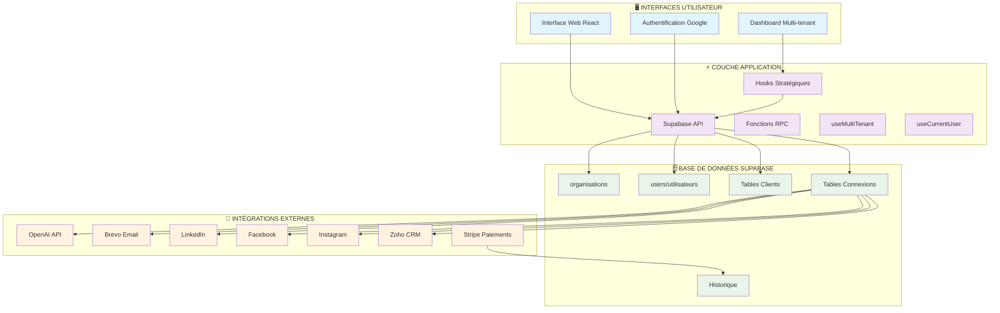
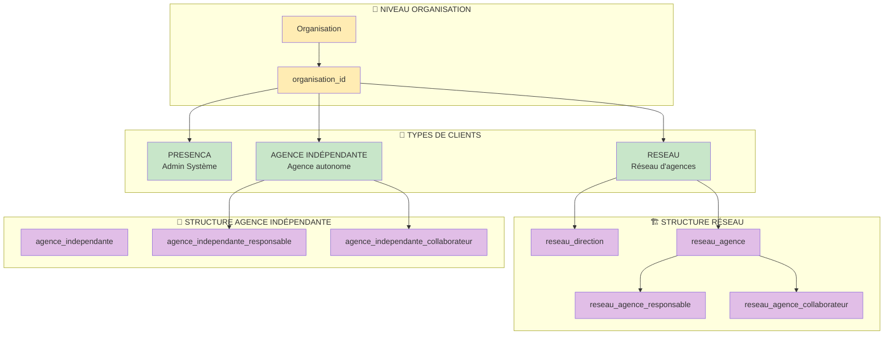
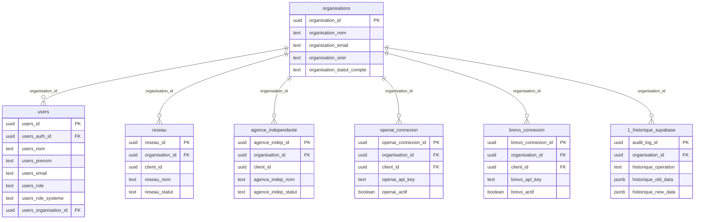
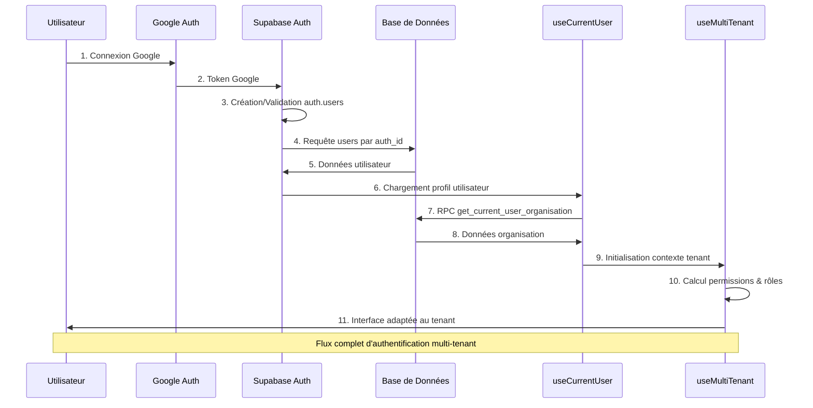
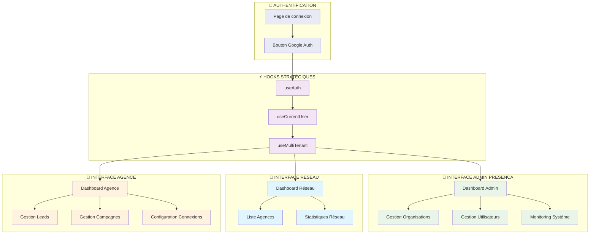

# Architecture Visuelle LeadgenAI - État Actuel

## 1. VUE D'ENSEMBLE SYSTÈME



## 2. ARCHITECTURE MULTI-TENANT



## 3. ARCHITECTURE BASE DE DONNÉES



## 4. FLUX D'AUTHENTIFICATION ACTUEL



## 5. SÉCURITÉ RLS (Row Level Security)

```mermaid
graph LR
    %% Utilisateurs
    subgraph "👤 UTILISATEURS"
        USER[Utilisateur]
        AUTH_UID[auth.uid()]
    end

    %% Fonctions de sécurité
    subgraph "🔐 FONCTIONS SÉCURITÉ"
        IS_ADMIN[is_admin_presenca()]
        GET_ORG[get_user_organisation_id()]
    end

    %% Politiques RLS
    subgraph "🛡️ POLITIQUES RLS"
        ADMIN_FULL[Admin PRESENCA<br/>Accès total]
        ORG_SCOPE[Accès limité<br/>à l'organisation]
        USER_SCOPE[Accès limité<br/>aux données utilisateur]
    end

    %% Tables avec RLS
    subgraph "📊 TABLES PROTÉGÉES"
        ORGS_T[organisations]
        USERS_T[users]
        CLIENTS_T[Tables clients]
        CONN_T[Tables connexions]
        HIST_T[Historique]
    end

    %% Flux de sécurité
    USER --> AUTH_UID
    AUTH_UID --> IS_ADMIN
    AUTH_UID --> GET_ORG
    
    IS_ADMIN --> ADMIN_FULL
    GET_ORG --> ORG_SCOPE
    AUTH_UID --> USER_SCOPE
    
    ADMIN_FULL --> ORGS_T
    ADMIN_FULL --> USERS_T
    ADMIN_FULL --> CLIENTS_T
    ADMIN_FULL --> CONN_T
    ADMIN_FULL --> HIST_T
    
    ORG_SCOPE --> CLIENTS_T
    ORG_SCOPE --> CONN_T
    ORG_SCOPE --> HIST_T
    
    USER_SCOPE --> USERS_T

    %% Styles
    classDef user fill:#e3f2fd
    classDef security fill:#fff3e0
    classDef policy fill:#e8f5e8
    classDef table fill:#fce4ec
    
    class USER,AUTH_UID user
    class IS_ADMIN,GET_ORG security
    class ADMIN_FULL,ORG_SCOPE,USER_SCOPE policy
    class ORGS_T,USERS_T,CLIENTS_T,CONN_T,HIST_T table
```

## 6. INTERFACES UTILISATEUR



## PROBLÈMES IDENTIFIÉS

### 🔴 Incohérences détectées
1. **Duplication tables utilisateurs** : `users` et `utilisateurs`
2. **Fichier Supabase manquant** : Erreur dans `lib/supabase.ts` avec variables Next.js
3. **Hooks non intégrés** : `useMultiTenant` créé mais pas utilisé dans l'interface
4. **RLS complexe** : Politiques multiples sur même table

### 🟡 Points d'attention
1. **Gestion des rôles** : Différences entre `users_role` et `users_role_systeme`
2. **Organisation ID** : Pas toujours cohérent entre tables
3. **Connexions externes** : Multiples APIs avec quotas à gérer

### 📋 Actions recommandées
1. Fusionner ou clarifier les tables utilisateurs
2. Corriger la configuration Supabase pour Vite
3. Intégrer les hooks stratégiques dans l'interface
4. Simplifier les politiques RLS redondantes
