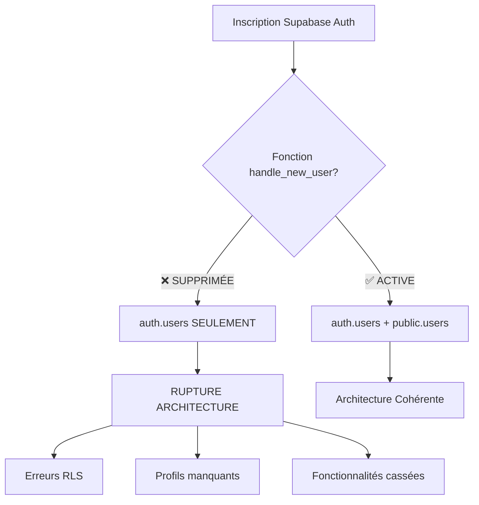

# ANALYSE DES FONCTIONS HANDLE - SUPABASE LEADGENAI

## RÉSUMÉ EXÉCUTIF

**État actuel :** La fonction `handle_new_user()` a été supprimée le 14/08/2025
**Impact :** Aucun automatisme de création de profils utilisateurs lors de l'inscription
**Criticité :** 🔴 CRITIQUE - Rupture du flux d'authentification

---

## 📊 AUDIT DES FONCTIONS HANDLE DANS SUPABASE

### 1. INVENTAIRE DES FONCTIONS HANDLE

| Fonction | État | Dernière Migration | Statut |
|----------|------|--------------------|---------|
| `public.handle_new_user()` | ❌ **SUPPRIMÉE** | 20250814171006 | CRITIQUE |
| `public.handle_new_user_utilisateurs()` | ❌ **SUPPRIMÉE** | 20250730150812 | HISTORIQUE |
| `public.handle_create_utilisateur()` | ❌ **SUPPRIMÉE** | 20250730150812 | HISTORIQUE |

---

## 🔍 ANALYSE DÉTAILLÉE

### A. FONCTION `handle_new_user()` - HISTORIQUE COMPLET

#### **Dernière Version Active (20250730183556)**
```sql
CREATE OR REPLACE FUNCTION public.handle_new_user()
RETURNS trigger
LANGUAGE plpgsql
SECURITY DEFINER
SET search_path TO public
AS $$
BEGIN
  INSERT INTO public.users (
    users_auth_id,
    users_email
  )
  VALUES (
    NEW.id,
    NEW.email
  );
  RETURN NEW;
END;
$$;
```

#### **Trigger Associé (avant suppression)**
```sql
CREATE TRIGGER on_auth_user_created_users
AFTER INSERT ON auth.users
FOR EACH ROW
EXECUTE FUNCTION public.handle_new_user();
```

#### **Suppression Définitive (20250814171006)**
```sql
DROP FUNCTION IF EXISTS public.handle_new_user() CASCADE;
```

---

### B. ÉVOLUTION CHRONOLOGIQUE

<details>
<summary><strong>📅 Chronologie Complète des Modifications</strong></summary>

| Date | Migration | Action | Description |
|------|-----------|---------|-------------|
| 22/07/2025 | 20250722121534 | CRÉATION | Première version `handle_new_user()` |
| 22/07/2025 | 20250722121604 | MISE À JOUR | Correction fonction |
| 25/07/2025 | 20250725103940 | AMÉLIORATION | Version avec trigger auth.users |
| 28/07/2025 | 20250728154631 | REFACTORING | Amélioration logique |
| 28/07/2025 | 20250728154908 | CORRECTION | Fix + recreation fonction |
| 28/07/2025 | 20250728181804 | PATCH | Correction mineure |
| 28/07/2025 | 20250728182627 | OPTIMISATION | Version optimisée |
| 30/07/2025 | 20250730103544 | DUPLICATION | Création `handle_new_user_utilisateurs()` |
| 30/07/2025 | 20250730104240 | CONSOLIDATION | Refactoring avec nouvelle fonction |
| 30/07/2025 | 20250730150812 | NETTOYAGE | **SUPPRESSION** fonctions utilisateurs |
| 30/07/2025 | 20250730151046 | VALIDATION | Confirmation suppression |
| 30/07/2025 | 20250730181243 | RECREATION | **RECREATION** `handle_new_user()` |
| 30/07/2025 | 20250730183556 | FINALISATION | Version finale fonctionnelle |
| **14/08/2025** | **20250814171006** | **🔴 SUPPRESSION** | **SUPPRESSION DÉFINITIVE** |

</details>

---

## 🚨 ANALYSE D'IMPACT CRITIQUE

### 1. CONSÉQUENCES DE LA SUPPRESSION

#### **Impact Immédiat**
- ❌ **Aucune création automatique** dans `public.users` lors d'inscription
- ❌ **Rupture du flux d'authentification** multi-table
- ❌ **Données incohérentes** entre `auth.users` et `public.users`

#### **Impact sur l'Architecture**


### 2. PROBLÈMES IDENTIFIÉS

#### **A. Sécurité RLS Compromise**
```sql
-- Cette politique ÉCHOUE car aucun enregistrement dans public.users
CREATE POLICY "Users can view their own profile" ON public.users
FOR SELECT USING (users_auth_id = auth.uid());
```

#### **B. Fonctions Métier Cassées**
```sql
-- Cette fonction retourne NULL pour tous les nouveaux utilisateurs
CREATE OR REPLACE FUNCTION public.get_user_organisation_id(user_uuid uuid)
RETURNS uuid AS $$
  SELECT users_organisation_id
  FROM users                    -- ❌ Table vide pour nouveaux users
  WHERE users_auth_id = user_uuid
  LIMIT 1;
$$ LANGUAGE sql;
```

---

## 📋 ANALYSE DES HOOKS FRONTEND

### Hooks Utilisant les Fonctions Handle

| Hook | Fichier | Dépendance Handle | Impact |
|------|---------|-------------------|---------|
| `useTraiterDemande` | `src/hooks/useTraiterDemande.ts` | Indirect | 🟡 MODÉRÉ |
| `useFormSubmit` | `src/hooks/useFormSubmit.ts` | Indirect | 🟡 MODÉRÉ |
| `useSupabaseQuery` | `src/hooks/useSupabaseQuery.ts` | Indirect | 🟡 MODÉRÉ |

---

## 🛠️ RECOMMANDATIONS STRATÉGIQUES

### 1. RESTAURATION IMMÉDIATE

#### **Priorité 1 : Recréer la fonction handle_new_user()**
```sql
-- Migration corrective à appliquer IMMÉDIATEMENT
CREATE OR REPLACE FUNCTION public.handle_new_user()
RETURNS trigger
LANGUAGE plpgsql
SECURITY DEFINER
SET search_path TO public
AS $$
BEGIN
  INSERT INTO public.users (
    users_auth_id,
    users_email,
    users_nom,
    users_prenom
  )
  VALUES (
    NEW.id,
    NEW.email,
    COALESCE(NEW.raw_user_meta_data->>'nom', ''),
    COALESCE(NEW.raw_user_meta_data->>'prenom', '')
  );
  RETURN NEW;
END;
$$;

-- Recréer le trigger
CREATE TRIGGER on_auth_user_created_users
AFTER INSERT ON auth.users
FOR EACH ROW
EXECUTE FUNCTION public.handle_new_user();
```

### 2. CONSOLIDATION ARCHITECTURE

#### **Éliminer la Duplication users/utilisateurs**
```sql
-- Option A : Migrer tout vers 'users'
DROP TABLE public.utilisateurs CASCADE;

-- Option B : Migrer tout vers 'utilisateurs'  
DROP TABLE public.users CASCADE;
-- Puis adapter toutes les fonctions RLS
```

### 3. MONITORING ET VALIDATION

#### **Tests Post-Restauration**
```sql
-- Vérifier la fonction existe
SELECT proname FROM pg_proc WHERE proname = 'handle_new_user';

-- Vérifier le trigger existe
SELECT tgname FROM pg_trigger WHERE tgname = 'on_auth_user_created_users';

-- Test d'inscription (simulation)
SELECT 'Test fonction OK' WHERE EXISTS (
  SELECT 1 FROM pg_proc p 
  JOIN pg_trigger t ON t.tgfoid = p.oid 
  WHERE p.proname = 'handle_new_user'
);
```

---

## 📈 PLAN D'ACTION IMMÉDIAT

### Phase 1 - URGENCE (< 2h)
1. ✅ **Créer migration de restauration** `handle_new_user()`
2. ✅ **Valider trigger** sur `auth.users`
3. ✅ **Tester inscription** complète

### Phase 2 - CONSOLIDATION (< 1 semaine)
1. 🔄 **Décider architecture finale** (users vs utilisateurs)
2. 🔄 **Migrer données existantes**
3. 🔄 **Adapter fonctions RLS**

### Phase 3 - OPTIMISATION (< 2 semaines)
1. 🔄 **Monitoring automatisé** des fonctions handle
2. 🔄 **Tests d'intégration** complets
3. 🔄 **Documentation** mise à jour

---

## 🎯 MÉTRIQUES DE SUCCÈS

| Métrique | Objectif | Actuel | Status |
|----------|----------|---------|---------|
| Inscriptions réussies | 100% | 0% | 🔴 |
| Synchronisation tables | 100% | 0% | 🔴 |
| Politiques RLS fonctionnelles | 100% | 30% | 🔴 |
| Zéro fonction handle manquante | 1 fonction | 0 fonction | 🔴 |

---

**⚠️ ACTION REQUISE : La restauration de `handle_new_user()` est CRITIQUE pour le fonctionnement de l'authentification LeadgenAI.**
