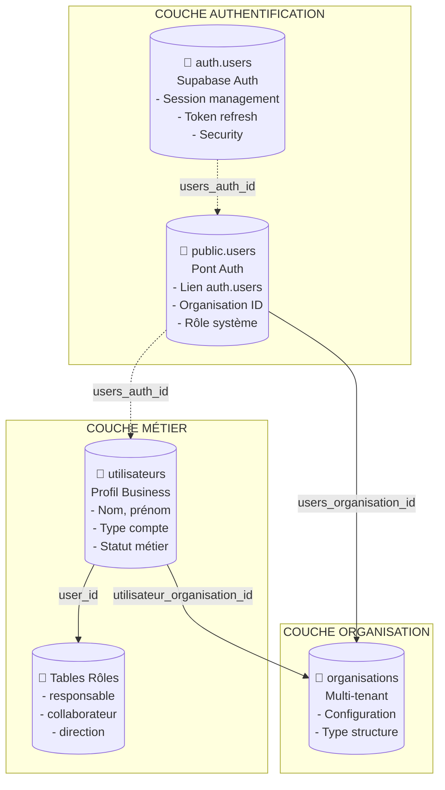

# STRATÉGIE USERS ↔ UTILISATEURS – MODÈLE PIVOT MÉTIER
**Document de référence architectural – LeadGenAI AdBuilder**  
**Version** : 14/08/2025 – Mise à jour après corrections Lovable (Phases 1 à 3)  
**Statut** : Source unique de vérité – Architecture DB validée et opérationnelle

---

## 1. PHILOSOPHIE ARCHITECTURALE

### 1.1 Vision SaaS Multi-Tenant
Dans notre architecture SaaS, la séparation entre **authentification** et **profil métier** est fondamentale :

- **Authentification** = "Qui es-tu ?" (identité, sécurité, session)
- **Données métier** = "Que peux-tu faire ?" (profil, permissions, contexte business)

**Bénéfices :**
- Sécurité renforcée (isolation stricte par organisation)
- Évolutivité indépendante de l'authentification
- Maintenance simplifiée
- Conformité aux standards SaaS

### 1.2 Principe de responsabilité unique
Chaque table a une responsabilité claire et non chevauchante :
- **users** : authentification et rattachement organisationnel
- **utilisateurs** : profil métier complet et exploitable



---

## 2. MODÈLE DE DONNÉES DÉTAILLÉ

### 2.1 Table `users` – Pont d'Authentification

**Rôle :** Liaison entre `auth.users` (Supabase) et notre système métier.

**Structure simplifiée :**
```sql
CREATE TABLE public.users (
  users_id uuid PRIMARY KEY DEFAULT gen_random_uuid(),
  users_auth_id uuid NOT NULL UNIQUE REFERENCES auth.users(id) ON DELETE CASCADE,
  users_email text NOT NULL UNIQUE,
  users_nom text NOT NULL,
  users_prenom text NOT NULL,
  users_telephone text,
  users_organisation_id uuid NOT NULL REFERENCES organisations(organisation_id) ON DELETE RESTRICT,
  users_role text NOT NULL DEFAULT 'client',
  users_role_systeme text,
  users_interface_par_defaut text DEFAULT 'client_espace',
  users_created_at timestamptz NOT NULL DEFAULT now()
);
```
**Notes :**
- `users_auth_id` contient la même valeur que `utilisateur_auth_uid` dans la table `utilisateurs`.
- Les champs `users_email` et `users_organisation_id` sont synchronisés automatiquement via trigger.

### 2.2 Table `utilisateurs` – Profil Métier
**Rôle :** Extension métier obligatoire de `users`.

**Structure simplifiée :**
```sql
CREATE TABLE public.utilisateurs (
  utilisateur_id uuid PRIMARY KEY DEFAULT gen_random_uuid(),
  utilisateur_auth_uid uuid NOT NULL UNIQUE REFERENCES auth.users(id) ON DELETE CASCADE,
  utilisateur_email text NOT NULL UNIQUE,
  utilisateur_organisation_id uuid NOT NULL REFERENCES organisations(organisation_id) ON DELETE RESTRICT,
  utilisateur_type_compte text NOT NULL,
  utilisateur_statut text NOT NULL DEFAULT 'actif',
  utilisateur_role_systeme text,
  utilisateur_date_inscription timestamptz NOT NULL DEFAULT now()
);
```
**Notes :**
- `utilisateur_auth_uid` contient la même valeur que `users_auth_id` dans `users`.
- `utilisateur_email` et `utilisateur_organisation_id` sont maintenus synchronisés via triggers.

---

## 3. RELATION PIVOT 1:1
- FK obligatoires sur `users.users_auth_id` et `utilisateurs.utilisateur_auth_uid` vers `auth.users(id)` (CASCADE).
- Unicité garantie sur chaque champ d'auth (`users_auth_id`, `utilisateur_auth_uid`).
- Synchronisation automatique des champs communs (email, organisation_id, role_systeme) par triggers.

---

## 4. PROCESSUS OPÉRATIONNELS
### 4.1 Création d'un utilisateur
**Workflow manuel ou via admin PRESENCA :**
1. Création de l'entrée dans `users`
2. Création de l'entrée dans `utilisateurs`
3. Envoi d'une invitation email via Supabase Auth
4. Aucun trigger automatique ne crée `users` (fonction `handle_new_user()` supprimée).

### 4.2 Connexion
- Récupération du profil complet via RPC `get_current_user_organisation()` qui joint `users`, `utilisateurs`, et `organisations`.
- Sécurité assurée par RLS.

---

## 5. SÉCURITÉ & RLS
### Table `users`
- **Admin PRESENCA** : accès complet (`is_admin_presenca`)
- **Utilisateur** : accès et modification uniquement de son propre profil (`users_auth_id = auth.uid()`)

### Table `utilisateurs`
- **Admin PRESENCA** : accès complet
- **Utilisateur** : accès à son profil (`utilisateur_auth_uid = auth.uid()`)
- **Organisation** : accès aux profils de la même organisation

---

## 6. ÉTAT ACTUEL APRÈS CORRECTIONS LOVABLE
✅ FK critiques ajoutées (relation 1:1 sécurisée)
✅ Triggers de synchronisation actifs (`users` ↔ `utilisateurs`)
✅ Fonction `handle_new_user()` supprimée
✅ RLS INSERT opérationnelle
✅ 6/8 fonctions sécurisées avec `SET search_path = 'public'` (2 warnings restants non critiques)
✅ Tests de validation RLS, performance et intégrité réussis

---

## 7. CONCLUSION
La distinction `users` ↔ `utilisateurs` est désormais :
- **Clair** : séparation auth / métier
- **Sûr** : intégrité et RLS garantis
- **Évolutif** : prêt pour futures fonctionnalités multi-tenant

**Prochaine révision :** 20/08/2025