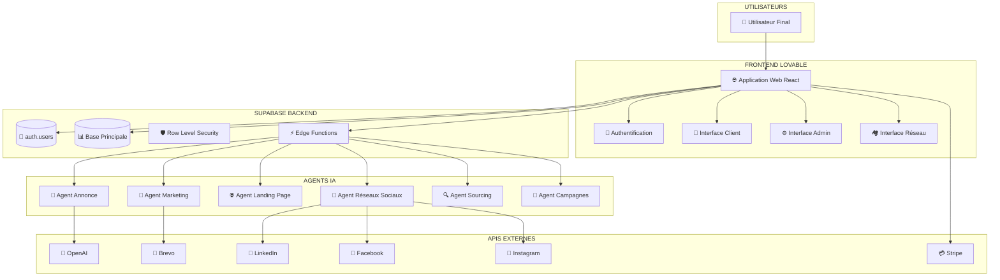
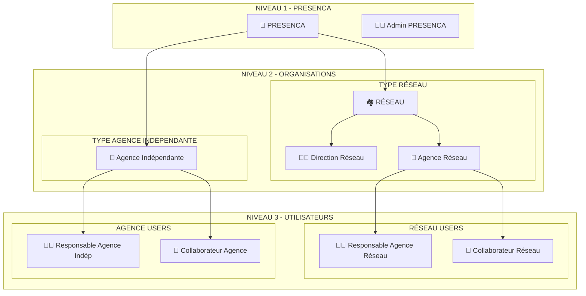
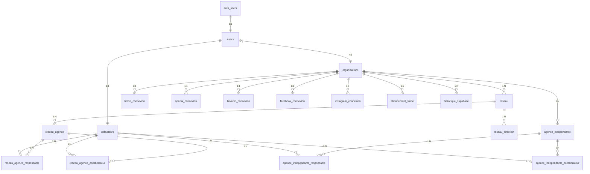
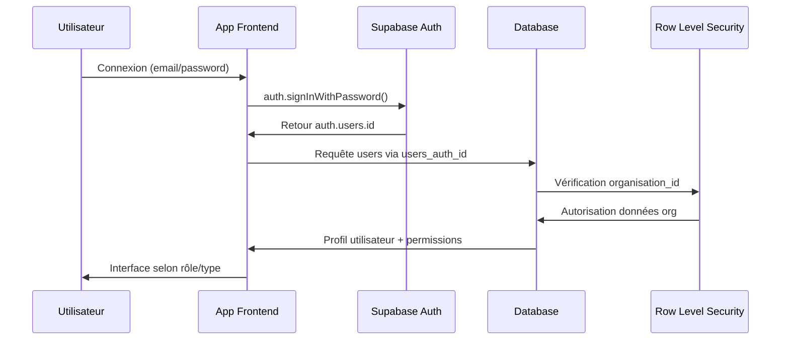
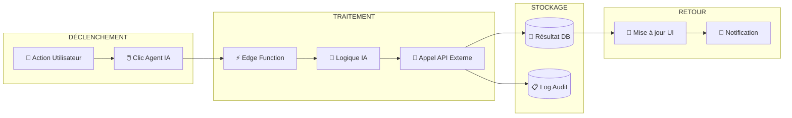
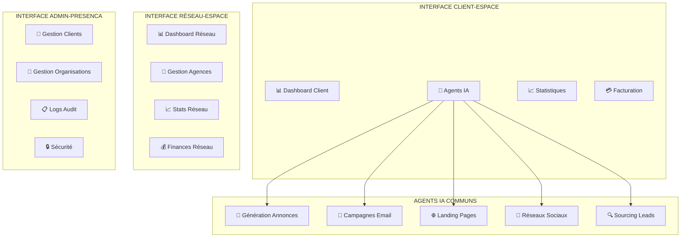

# ARCHITECTURE LEADGENAI ADBUILDER
**Diagramme d'architecture généré le 14/08/2025**

---

## 🎯 VUE D'ENSEMBLE SYSTÈME



---

## 🏗️ ARCHITECTURE MULTI-TENANT



---

## 📊 ARCHITECTURE BASE DE DONNÉES



---

## 🔐 FLUX D'AUTHENTIFICATION



---

## 🎯 FLUX AGENTS IA



---

## 🛡️ SÉCURITÉ RLS

```mermaid
graph TB
    subgraph "POLITIQUES RLS"
        ORG_POLICY[🏢 organisation_id = get_user_organisation_id()]
        ADMIN_POLICY[👨‍💼 is_admin_presenca()]
        SELF_POLICY[👤 user_id = auth.uid()]
    end
    
    subgraph "TABLES PROTÉGÉES"
        USERS_TABLE[(users)]
        UTILISATEURS_TABLE[(utilisateurs)]
        ORG_TABLE[(organisations)]
        CLIENT_TABLES[(tables clients)]
        CONNEXION_TABLES[(tables connexions)]
    end
    
    ORG_POLICY --> CLIENT_TABLES
    ORG_POLICY --> CONNEXION_TABLES
    ADMIN_POLICY --> ORG_TABLE
    ADMIN_POLICY --> USERS_TABLE
    SELF_POLICY --> UTILISATEURS_TABLE
```

---

## 📱 INTERFACES UTILISATEUR



---

## 💡 RECOMMANDATIONS

### ✅ Points Forts Actuels
- Architecture multi-tenant bien structurée
- Séparation claire des rôles et permissions
- Sécurité RLS implémentée
- Agents IA spécialisés

### ⚠️ Points d'Attention
- Relations FK à vérifier entre tables
- Triggers audit à compléter
- Tests de sécurité RLS à effectuer
- Documentation technique à synchroniser

### 🎯 Prochaines Étapes Suggérées
1. **Audit Supabase** : Vérifier intégrité des tables et relations
2. **Tests RLS** : Valider isolation entre organisations  
3. **Documentation** : Finaliser documentation technique
4. **Tests Utilisateur** : Valider parcours complets par rôle

---

**Demandez à OpenAI de créer un diagramme similaire et nous comparerons nos visions !** 🚀
