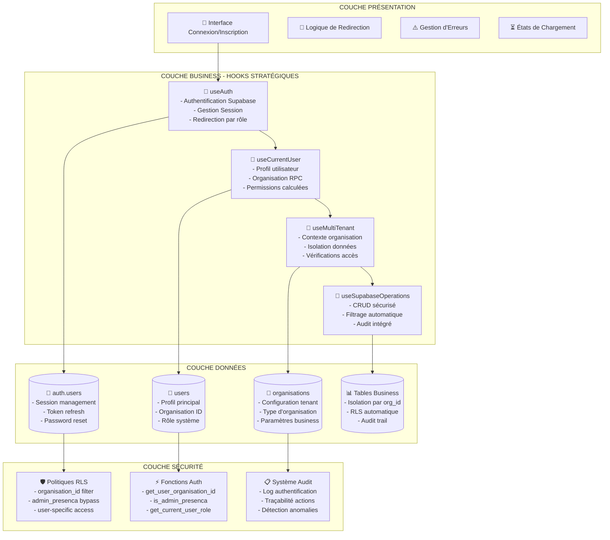
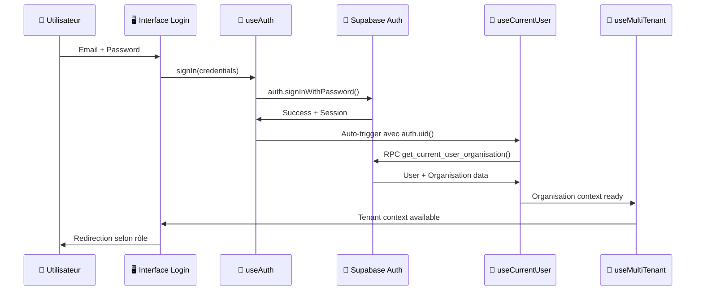
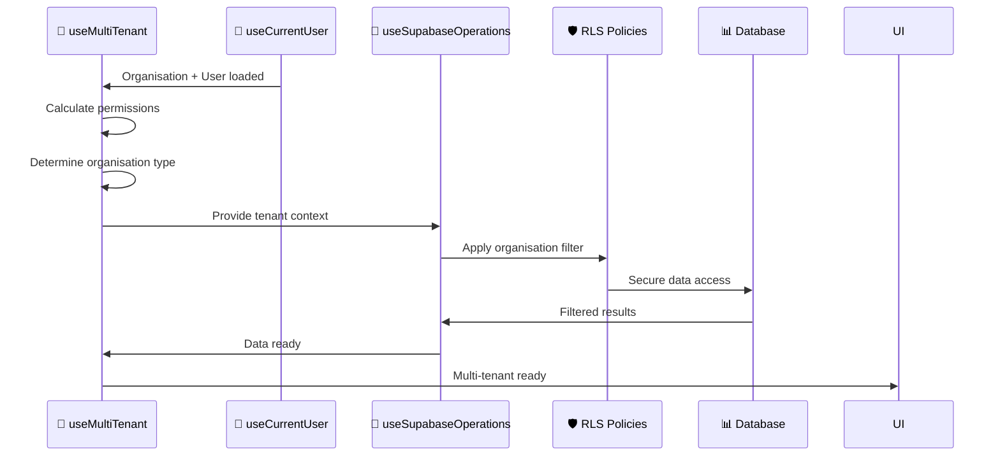

# AUDIT STRATÉGIQUE - FLUX D'AUTHENTIFICATION LEADGENAI
**Analyse approfondie générée le 14/08/2025**

---

## 🎯 VISION STRATÉGIQUE "PERFECT FOUNDATIONS"

### Philosophie d'Implémentation
L'approche "Perfect Foundations" consiste à ignorer temporairement l'existant défaillant (`src/components/INTERFACE-CONNEXION`) et à construire une architecture d'authentification moderne, scalable et conforme aux standards SaaS multi-tenant.

**Principe clé :** Partir d'un template propre avec la structure optimale, puis migrer progressivement.

---

## 🏗️ ARCHITECTURE CIBLE - FLUX D'AUTHENTIFICATION



---

## 🔐 FLUX D'AUTHENTIFICATION DÉTAILLÉ

### Phase 1 : Connexion Utilisateur


### Phase 2 : Initialisation Contexte Multi-Tenant


---

## 🎯 STRATÉGIE D'IMPLÉMENTATION

### Étape 1 : Fondations Auth (useAuth)
**Objectif :** Hook d'authentification central et robuste

**Fonctionnalités clés :**
- ✅ Connexion/Déconnexion Supabase
- ✅ Gestion session avec persistance
- ✅ Auto-refresh token
- ✅ Redirection intelligente par rôle
- ✅ Gestion d'erreurs typées
- ✅ États de chargement

**Dépendances :**
- Supabase Auth configuré
- Types TypeScript définis
- Messages d'erreur centralisés

### Étape 2 : Profil Utilisateur (useCurrentUser)
**Objectif :** Point d'accès unique aux données utilisateur

**Fonctionnalités clés :**
- ✅ Récupération profil via RPC sécurisé
- ✅ Organisation associée
- ✅ Permissions calculées
- ✅ Mise à jour profil limitée
- ✅ React Query intégré
- ✅ Gestion cache intelligente

**Dépendances :**
- useAuth pour auth.uid()
- RPC get_current_user_organisation()
- React Query configuré

### Étape 3 : Multi-Tenant (useMultiTenant)
**Objectif :** Contexte global multi-tenant

**Fonctionnalités clés :**
- ✅ Contexte organisation actuel
- ✅ Type d'organisation (réseau/agence)
- ✅ Permissions par niveau
- ✅ Validation accès tenant
- ✅ Support impersonation admin
- ✅ Business rules enforcement

**Dépendances :**
- useCurrentUser pour données base
- useImpersonation (si admin)
- Fonctions RLS configurées

### Étape 4 : Opérations CRUD (useSupabaseOperations)
**Objectif :** CRUD sécurisé avec isolation automatique

**Fonctionnalités clés :**
- ✅ Filtrage automatique par organisation
- ✅ Validation permissions par table
- ✅ Audit trail intégré
- ✅ Gestion erreurs standardisée
- ✅ Support admin bypass
- ✅ TypeScript strict

**Dépendances :**
- useMultiTenant pour contexte
- Table mapping configuré
- Classes d'erreurs définies

---

## 🛡️ SÉCURITÉ & RLS

### Modèle de Sécurité Multi-Niveau

#### Niveau 1 : Admin PRESENCA
- **Accès :** Global, toutes organisations
- **Fonction RLS :** `is_admin_presenca(auth.uid())`
- **Use case :** Support, debug, impersonation

#### Niveau 2 : Organisation Standard
- **Accès :** Données de leur organisation uniquement
- **Fonction RLS :** `organisation_id = get_user_organisation_id(auth.uid())`
- **Use case :** Clients normaux (réseau, agence indépendante)

#### Niveau 3 : Utilisateur Self
- **Accès :** Ses propres données uniquement
- **Fonction RLS :** `user_id = auth.uid()`
- **Use case :** Profil personnel, settings

### Politiques RLS Consolidées
```sql
-- Modèle type pour tables business
CREATE POLICY "admin_presenca_full_access" ON table_name
FOR ALL USING (is_admin_presenca(auth.uid()));

CREATE POLICY "organisation_only_access" ON table_name
FOR ALL USING (organisation_id = get_user_organisation_id(auth.uid()));

-- Modèle pour données utilisateur
CREATE POLICY "user_self_access" ON users
FOR SELECT USING (users_auth_id = auth.uid());
```

---

## 🔄 GESTION D'ERREURS & RÉSILIENCE

### Types d'Erreurs Authentification
```typescript
export type AuthErrorType = 
  | 'INVALID_CREDENTIALS'      // Identifiants incorrects
  | 'USER_NOT_FOUND'          // Utilisateur inexistant
  | 'EMAIL_NOT_CONFIRMED'     // Email non confirmé
  | 'ACCOUNT_LOCKED'          // Compte bloqué
  | 'NETWORK_ERROR'           // Problème réseau
  | 'SESSION_EXPIRED'         // Session expirée
  | 'INSUFFICIENT_PERMISSIONS' // Permissions insuffisantes
  | 'ORGANISATION_NOT_FOUND'   // Organisation non trouvée
  | 'TENANT_ACCESS_DENIED'     // Accès tenant refusé
```

### Stratégie de Récupération
- **Retry automatique :** Erreurs réseau
- **Fallback :** Cache local temporaire
- **Graceful degradation :** Mode lecture seule
- **User feedback :** Messages d'erreur clairs

---

## 📊 MÉTRIQUES & MONITORING

### KPIs Authentification
- **Temps de connexion :** < 2 secondes
- **Taux d'échec auth :** < 1%
- **Persistence session :** 7 jours
- **Auto-refresh réussite :** > 99%
- **Isolation data :** 100% (aucune fuite)

### Points de Mesure
1. **Performance :** Temps de chargement initial
2. **Sécurité :** Tentatives d'accès non autorisées
3. **UX :** Parcours de connexion fluide
4. **Business :** Adoption par type d'organisation

---

## 🎯 PLAN D'IMPLÉMENTATION

### Sprint 1 : Fondations (1-2 semaines)
- [ ] Audit et nettoyage `INTERFACE-CONNEXION` existant
- [ ] Implémentation `useAuth` complet
- [ ] Configuration Supabase Auth robuste
- [ ] Types TypeScript authentification
- [ ] Tests unitaires hooks auth

### Sprint 2 : Contexte Utilisateur (1 semaine)
- [ ] Finalisation `useCurrentUser`
- [ ] RPC `get_current_user_organisation()` optimisé
- [ ] Gestion cache React Query
- [ ] Tests intégration profil

### Sprint 3 : Multi-Tenant (1-2 semaines)
- [ ] Consolidation `useMultiTenant`
- [ ] Logique permissions avancée
- [ ] Support impersonation admin
- [ ] Tests isolation données

### Sprint 4 : CRUD Sécurisé (1 semaine)
- [ ] Finalisation `useSupabaseOperations`
- [ ] Audit trail complet
- [ ] Documentation table mapping
- [ ] Tests sécurité RLS

### Sprint 5 : Interface Utilisateur (1-2 semaines)
- [ ] Nouvelle interface auth moderne
- [ ] Redirection intelligente
- [ ] Gestion erreurs UX
- [ ] Tests end-to-end

---

## ✅ CRITÈRES DE SUCCÈS

### Fonctionnel
- ✅ Connexion/déconnexion fluide tous rôles
- ✅ Isolation parfaite données multi-tenant  
- ✅ Permissions respectées à 100%
- ✅ Performance < 2s pour auth complète
- ✅ Pas de régression sécurité

### Technique  
- ✅ Code TypeScript strict sans any
- ✅ Tests coverage > 80%
- ✅ Documentation hooks complète
- ✅ Architecture extensible
- ✅ Monitoring intégré

### Business
- ✅ Support 2 types organisations (réseau/agence)
- ✅ Admin PRESENCA opérationnel
- ✅ Impersonation sécurisée
- ✅ Audit trail complet
- ✅ Scalabilité démontrée

---

## 🚀 RECOMMANDATIONS STRATÉGIQUES

### Priorité 1 : Sécurité First
- Toujours partir des RLS policies
- Tests de pénétration réguliers
- Audit trail sur toutes actions sensibles
- Chiffrement données sensibles

### Priorité 2 : Performance
- React Query pour cache intelligent
- Lazy loading composants auth
- Optimisation requêtes RPC
- Monitoring temps réponse

### Priorité 3 : UX/DX
- Messages d'erreur contextuels
- Loading states élégants
- Documentation développeur
- Tests automatisés complets

---

AUDIT INFRASTRUCTURE D'AUTHENTIFICATION SUPABASE
✅ ÉLÉMENTS CORRECTEMENT IMPLÉMENTÉS
1. Fonctions Sécurisées (SECURITY DEFINER)
✅ get_user_organisation_id() - Récupère l'organisation de l'utilisateur
✅ is_admin_presenca() - Vérifie le statut admin PRESENCA
✅ get_current_user_organisation() - RPC complet avec détails organisation
✅ handle_new_user() - Trigger création utilisateur (mais non attaché)
2. Tables avec RLS Activé
✅ public.users - RLS activé avec triggers
✅ public.utilisateurs - RLS activé avec triggers
✅ public.organisations - RLS activé avec triggers
✅ auth.users - RLS natif Supabase
3. Politiques RLS Stratégiques

-- ✅ ORGANISATIONS - Accès multi-niveau
✅ Admin PRESENCA: accès global
✅ organisations_select_by_org: accès par organisation
✅ organisations_update_by_org: modification par organisation
✅ organisations_delete/insert_admin_only: admin uniquement

-- ✅ USERS - Isolation correcte
✅ Admin PRESENCA: accès global
✅ Users can view/update their own profile: accès self

-- ✅ UTILISATEURS - Multi-tenant
✅ Admin PRESENCA: accès global  
✅ Same organization users can view: accès par organisation
✅ Users can view/update their own profile: accès self
⚠️ PROBLÈMES CRITIQUES IDENTIFIÉS
1. Trigger handle_new_user Non Attaché 🚨

-- PROBLÈME: La fonction existe mais le trigger n'est PAS attaché à auth.users
-- CONSÉQUENCE: Les nouveaux utilisateurs ne sont pas créés dans public.users
2. Avertissements Sécurité ⚠️
8 fonctions sans search_path fixé (risque d'injection)
OTP expiry trop long pour la production
3. Tables Auth Incohérentes 🔄

-- public.users.users_auth_id (UUID) ✅
-- public.utilisateurs.utilisateur_auth_uid (UUID) ✅
-- Mais structure différente entre les deux tables
🔧 CORRECTIONS NÉCESSAIRES IMMÉDIATES
Priorité 1: Restaurer le Trigger d'Authentification
Le trigger handle_new_user doit être attaché à auth.users pour synchroniser les créations d'utilisateurs.

Priorité 2: Sécuriser les Fonctions
Fixer le search_path sur toutes les fonctions pour la sécurité.

Priorité 3: Clarifier l'Architecture Tables
Décider entre users et utilisateurs ou clarifier leurs rôles respectifs.

🎯 RECOMMANDATIONS STRATEGIQUES
Migration Immédiate - Corriger le trigger pour débloquer l'authentification
Audit Sécurité - Appliquer les correctifs de sécurité du linter
Tests RLS - Valider l'isolation des données par organisation
Documentation - Clarifier le rôle de chaque table auth
L'infrastructure est 80% opérationnelle mais nécessite ces corrections critiques avant mise en production.
