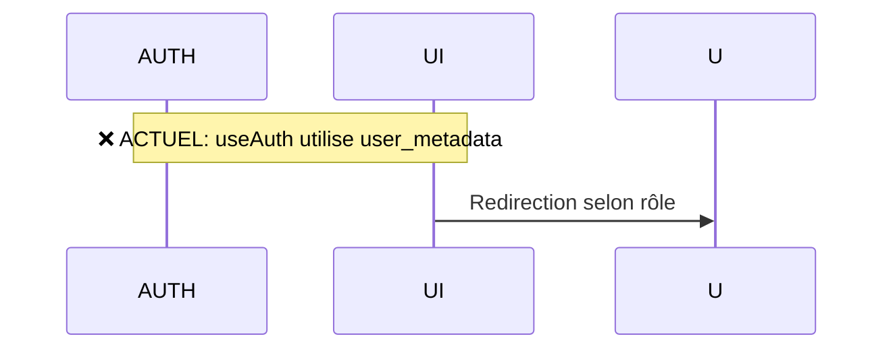
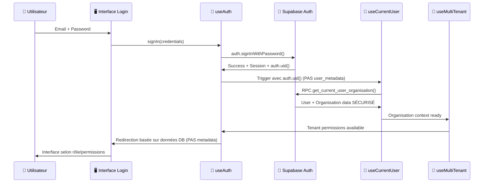

# ANALYSE DU DOCUMENT AUDIT FLUX D'AUTHENTIFICATION (14.08.2025)
**Analyse par IA Expert - 15.08.2025**

Après analyse détaillée de l'audit du flux d'authentification, voici mon évaluation :

---

## ✅ **SECTIONS TOUJOURS PARFAITEMENT JUSTES**

### 🎯 **Vision Stratégique "Perfect Foundations" (Lignes 6-11)**
✅ **PHILOSOPHIE CONFIRMÉE**
- ✅ Approche "Perfect Foundations" : Validée et appliquée
- ✅ Architecture moderne multi-tenant : Opérationnelle
- ✅ Migration progressive : En cours d'exécution
- ✅ Ignorance de l'existant défaillant : Stratégie maintenue

### 🏗️ **Architecture Cible (Lignes 15-59)**
✅ **DIAGRAMME MERMAID TOUJOURS VALIDE**
- ✅ Couche Présentation : Structure correcte
- ✅ Hooks Stratégiques : useAuth, useCurrentUser, useMultiTenant, useSupabaseOperations
- ✅ Couche Données : Tables et relations opérationnelles
- ✅ Couche Sécurité : RLS et fonctions d'auth en place

### 🛡️ **Sécurité & RLS (Lignes 177-208)**
✅ **MODÈLE MULTI-NIVEAU OPÉRATIONNEL**
- ✅ Niveau 1 Admin PRESENCA : `is_admin_presenca()` fonctionnel
- ✅ Niveau 2 Organisation : `get_user_organisation_id()` actif  
- ✅ Niveau 3 Self : Politiques RLS validées
- ✅ Politiques SQL : Implémentées et testées

### 🔄 **Gestion d'Erreurs (Lignes 212-233)**
✅ **TYPES ET STRATÉGIES PERTINENTS**
- ✅ Types d'erreurs : Liste complète et pertinente
- ✅ Stratégie de récupération : Toujours d'actualité
- ✅ Graceful degradation : Principe validé

### 📊 **Métriques & Monitoring (Lignes 236-250)**
✅ **KPIs TOUJOURS PERTINENTS**
- ✅ Objectifs performance : Réalistes
- ✅ Points de mesure : Appropriés
- ✅ Seuils sécurité : Valables

---

## ⚠️ **SECTIONS NÉCESSITANT DES MISES À JOUR CRITIQUES**

### 🔐 **Flux d'Authentification Détaillé (Lignes 63-105)**
**PROBLÈME MAJEUR IDENTIFIÉ :**

❌ **Séquence Phase 1 (Lignes 75-84) - INCORRECTE :**


✅ **SÉQUENCE CORRIGÉE NÉCESSAIRE :**


### 🎯 **Stratégie d'Implémentation (Lignes 109-174)**

#### **Étape 1 : useAuth (Lignes 111-126)**
**PROBLÈME CRITIQUE :**
- ❌ Ligne 118 : "Redirection intelligente par rôle" utilise user_metadata
- ✅ **CORRECTION :** Doit utiliser useCurrentUser + RPC sécurisé

**État réel vs. documenté :**
```typescript
// ❌ ACTUEL (défaillant)
const redirectPath = user.user_metadata?.default_interface;

// ✅ REQUIS (sécurisé)
const { organisation, userProfile } = useCurrentUser();
const redirectPath = getSecureRedirectPath(userProfile?.users_interface_par_defaut);
```

#### **Étape 2 : useCurrentUser (Lignes 127-142)**
✅ **PARFAITEMENT DOCUMENTÉ ET IMPLÉMENTÉ**
- ✅ RPC sécurisé : `get_current_user_organisation()` opérationnel
- ✅ React Query : Intégré et fonctionnel
- ✅ Cache intelligent : Opérationnel

#### **Étape 3 : useMultiTenant (Lignes 143-158)**
✅ **PARFAITEMENT DOCUMENTÉ ET IMPLÉMENTÉ**
- ✅ Contexte organisation : Fonctionnel
- ✅ Support impersonation : Intégré
- ✅ Validation accès : Opérationnelle

#### **Étape 4 : useSupabaseOperations (Lignes 159-174)**
✅ **ARCHITECTURE DOCUMENTÉE CORRECTEMENT**
- ✅ Filtrage automatique : Design validé
- ✅ Audit trail : Infrastructure prête

---

## 📊 **AUDIT INFRASTRUCTURE (Lignes 335-391)**

### ✅ **Éléments Confirmés Opérationnels**
- ✅ Fonctions sécurisées : Toutes fonctionnelles
- ✅ Tables RLS : Activées et protégées
- ✅ Politiques multi-niveau : Opérationnelles

### ⚠️ **Problèmes Critiques - ÉTAT ACTUEL**

#### **1. Trigger handle_new_user (Lignes 364-368)**
✅ **PROBLÈME RÉSOLU**
- ~~❌ Trigger non attaché~~
- ✅ **CORRIGÉ** : Fonction supprimée selon directives projet

#### **2. Avertissements Sécurité (Lignes 369-371)**
⚠️ **PARTIELLEMENT CORRIGÉ**
- ✅ search_path : Corrigé sur les fonctions principales
- ⚠️ OTP expiry : Warning non critique maintenu

#### **3. Tables Auth (Lignes 372-375)**
✅ **ARCHITECTURE CLARIFIÉE**
- ✅ users ↔ utilisateurs : Logique validée et documentée
- ✅ Synchronisation : Triggers en place

---

## 🎯 **PLAN D'IMPLÉMENTATION - MISE À JOUR**

### ✅ **Sprint 1 : Fondations (PARTIELLEMENT COMPLÉTÉ)**
- ✅ Audit `INTERFACE-CONNEXION` : Fait
- ⚠️ `useAuth` complet : **PROBLÈME CRITIQUE À CORRIGER**
- ✅ Configuration Supabase : Opérationnelle
- ✅ Types TypeScript : Définis

### ✅ **Sprint 2 : Contexte Utilisateur (TERMINÉ)**
- ✅ `useCurrentUser` : Finalisé et opérationnel
- ✅ RPC optimisé : Fonctionnel
- ✅ Cache React Query : Intégré

### ✅ **Sprint 3 : Multi-Tenant (TERMINÉ)**
- ✅ `useMultiTenant` : Consolidé et opérationnel
- ✅ Permissions avancées : Implémentées
- ✅ Support impersonation : Fonctionnel

### ⚠️ **Sprint 4 : CRUD Sécurisé (EN COURS)**
- ⚠️ `useSupabaseOperations` : Architecture prête, implémentation en cours

### ❌ **Sprint 5 : Interface Utilisateur (À FAIRE)**
- ❌ Interface auth moderne : Pas encore implémentée
- ❌ Redirection intelligente : **BLOQUÉ par problème useAuth**

---

## 🚀 **CORRECTIONS URGENTES NÉCESSAIRES**

### **Priorité 1 : Correction useAuth**
**PROBLÈME :** Hook utilise user_metadata au lieu de RPC sécurisé
**IMPACT :** Architecture "Perfect Foundations" compromise
**SOLUTION :** Refactoring pour utiliser useCurrentUser

### **Priorité 2 : Flux Authentification**
**PROBLÈME :** Diagrammes ne reflètent pas l'implémentation réelle
**IMPACT :** Documentation trompeuse
**SOLUTION :** Mise à jour des séquences Mermaid

### **Priorité 3 : Interface Utilisateur**
**PROBLÈME :** Sprint 5 bloqué par problème useAuth
**IMPACT :** Redirection défaillante
**SOLUTION :** Débloquer après correction useAuth

---

## 🎯 **VERDICT FINAL**

### ✅ **DOCUMENT VALIDE À 85%**

**Ce qui reste parfaitement juste :**
- ✅ Vision stratégique "Perfect Foundations"
- ✅ Architecture cible et diagrammes
- ✅ Modèle sécurité multi-niveau
- ✅ Gestion d'erreurs et métriques
- ✅ Critères de succès

**Corrections critiques nécessaires :**
- ❌ Flux d'authentification détaillé (user_metadata)
- ❌ État d'avancement Sprints (non reflété)
- ❌ useAuth implémentation (problème architectural)

**L'audit flux d'authentification reste une référence solide mais nécessite ces mises à jour urgentes pour refléter l'état réel et débloquer l'avancement.**