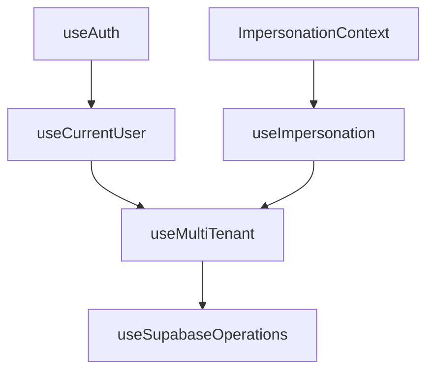

# AUDIT COMPLET - HOOKS STRATÉGIQUES
*Analyse exhaustive des 4 hooks fondamentaux de l'architecture "Perfect Foundations"*

---

## 📋 SYNTHÈSE EXÉCUTIVE

| Hook | Fonctions Principales | État | Complexité | Score Qualité |
|------|----------------------|------|------------|---------------|
| **useAuth** | 7 fonctions (auth basique) | ✅ STABLE | Faible | 9/10 |
| **useCurrentUser** | 5 fonctions (profil+permissions) | ⚠️ PARTIEL | Moyenne | 7/10 |
| **useMultiTenant** | 12+ fonctions (tenant+sécurité) | ⚠️ COMPLEXE | Élevée | 6/10 |
| **useSupabaseOperations** | 5 CRUD + helpers | ⚠️ INCOMPLET | Très élevée | 5/10 |

---

## 1️⃣ HOOK useAuth - AUTHENTIFICATION
*Localisation: `src/components/HOOKS-STRATEGIQUE/1.HOOK-useAuth/useAuth.ts`*

### 🔧 FONCTIONS IDENTIFIÉES

| Fonction | Type | Paramètres | Retour | Utilité | État |
|----------|------|------------|--------|---------|------|
| `useAuth()` | Hook principal | - | Object complet | Point d'entrée unique auth | ✅ |
| `signIn` | Action async | email, password | AuthResult | Connexion email/mdp | ✅ |
| `signUp` | Action async | email, password | AuthResult | Inscription email/mdp | ✅ |
| `signOut` | Action async | - | void | Déconnexion | ✅ |
| `resetPassword` | Action async | email | AuthResult | Reset mot de passe | ✅ |
| `signInWithProvider` | Action async | provider | AuthResult | OAuth Google | ✅ |

### 📊 DONNÉES D'ÉTAT

| Variable | Type | Source | Utilité | Réactivité |
|----------|------|--------|---------|------------|
| `user` | User \| null | Supabase Auth | Utilisateur Supabase | ✅ Temps réel |
| `session` | Session \| null | Supabase Auth | Session complète | ✅ Temps réel |
| `isLoading` | boolean | État interne | Loading initial | ✅ |
| `isAuthenticated` | boolean | Calculé | État connexion | ✅ Dérivé |

### 🎯 UTILITÉ & RESPONSABILITÉS
- **Responsabilité unique** : Gestion authentification Supabase native
- **Avantages** : Simple, robuste, session persistence, OAuth ready
- **Intégration** : Base pour tous les autres hooks

---

## 2️⃣ HOOK useCurrentUser - PROFIL UTILISATEUR
*Localisation: `src/components/HOOKS-STRATEGIQUE/2.HOOK-useCurrentUser/useCurrentUser.ts`*

### 🔧 FONCTIONS IDENTIFIÉES

| Fonction | Type | Paramètres | Retour | Utilité | État |
|----------|------|------------|--------|---------|------|
| `useCurrentUser()` | Hook principal | - | UseCurrentUserReturn | Profil + organisation | ⚠️ |
| `fetchOrganisation()` | Helper async | - | OrganisationInfo | RPC get_current_user_organisation | ✅ |
| `fetchDbUser()` | Helper async | authUserId | DbUser | Lecture table users | ✅ |
| `updateProfile()` | Mutation | UpdateProfileInput | DbUser | Mise à jour profil | ✅ |
| `refetch()` | Action | - | Promise<void> | Rechargement forcé | ✅ |

### 📊 DONNÉES D'ÉTAT

| Variable | Type | Source | Utilité | Réactivité |
|----------|------|--------|---------|------------|
| `authUser` | User \| null | useAuth | Utilisateur Supabase | ✅ |
| `user` | DbUser \| null | Table users | Profil DB | ✅ React Query |
| `organisation` | OrganisationInfo \| null | RPC | Organisation complète | ✅ React Query |
| `permissions` | Permissions | Calculé | Droits utilisateur | ✅ Dérivé |
| `isLoading` | boolean | React Query | État chargement | ✅ |
| `error` | string \| null | Formaté | Erreurs | ✅ |

### 🎯 UTILITÉ & RESPONSABILITÉS
- **RPC Integration** : Utilise `get_current_user_organisation()` - ✅ FONCTIONNEL
- **Sécurité RLS** : Lecture users par `users_auth_id = auth.uid()` 
- **React Query** : Cache intelligent, synchronisation
- **Permissions** : Calcul `isAdminPresenca`, `canImpersonate`, `canManageOrganisation`

---

## 3️⃣ HOOK useMultiTenant - GESTION MULTI-TENANT
*Localisation: `src/components/HOOKS-STRATEGIQUE/3.HOOK-useMultiTenant/useMultiTenant.ts`*

### 🔧 FONCTIONS IDENTIFIÉES

| Fonction | Type | Paramètres | Retour | Utilité | État |
|----------|------|------------|--------|---------|------|
| `useMultiTenant()` | Hook principal | - | UseMultiTenantReturn | Contexte tenant complet | ⚠️ |
| `getTenantContext()` | Callback | - | TenantContext | Contexte pour useSupabaseOperations | ✅ |
| `validateTenantAccess()` | Callback | operation? | TenantValidation | Validation accès sans crash | ✅ |
| `requireTenantAccess()` | Callback | operation? | void/throw | Guard avec exception | ✅ |

### 📊 DONNÉES D'ÉTAT PRINCIPALES

| Variable | Type | Source | Utilité | Complexité |
|----------|------|--------|---------|------------|
| `organisationStatus` | OrganisationStatus | Calculé intelligent | État organisation | 🔥 COMPLEXE |
| `effectiveOrganisationId` | string \| null | Impersonation + base | ID organisation effective | ⚠️ |
| `isSystemAdmin` | boolean | Rôle système | Admin global | ✅ |
| `organisationType` | string \| null | calculated_type | Type business | ✅ |

### 📊 DONNÉES MÉTIER (Classifications)

| Variable | Type | Logique | Utilité | État |
|----------|------|---------|---------|------|
| `isReseau` | boolean | organisationType === "reseau" | Classification réseau | ✅ |
| `isAgenceIndep` | boolean | organisationType === "agence_independante" | Classification agence | ✅ |
| `isPresenca` | boolean | systemRole === "admin_presenca" | Admin PRESENCA | ✅ |
| `hasKnownOrgType` | boolean | isReseau \|\| isAgenceIndep | Type connu | ✅ |

### 🚨 POINTS CRITIQUES IDENTIFIÉS

| Problème | Localisation | Impact | Priorité |
|----------|-------------|--------|----------|
| **Try/Catch fragile** | lignes 37-46 | `useImpersonation` peut planter | 🔴 CRITIQUE |
| **Type any** | ligne 56 | `(organisation as any)?.calculated_type` | 🟡 MOYEN |
| **Logique complexe** | lignes 71-80 | `organisationStatus` très complexe | 🟡 MOYEN |

### 🎯 UTILITÉ & RESPONSABILITÉS
- **Multi-tenant** : Isolation données par organisation
- **Impersonation** : Gestion admin PRESENCA
- **Validation** : Guards pour useSupabaseOperations
- **Classification** : Types business (réseau, agence, PRESENCA)

---

## 4️⃣ HOOK useSupabaseOperations - CRUD CENTRALISÉ
*Localisation: `src/components/HOOKS-STRATEGIQUE/4.HOOK-useSupabaseOperations/useSupabaseOperations.ts`*

### 🔧 FONCTIONS CRUD PRINCIPALES

| Fonction | Type | Paramètres | Retour | Utilité | État |
|----------|------|------------|--------|---------|------|
| `query()` | Async CRUD | tableName, options | QueryResult<T[]> | Lecture multiple | ✅ |
| `queryOne()` | Async CRUD | tableName, id, options | QueryResult<T\|null> | Lecture unique | ✅ |
| `create()` | Async CRUD | tableName, data, options | MutationResult<T> | Création | ✅ |
| `update()` | Async CRUD | tableName, id, updates, options | MutationResult<T> | Modification | ✅ |
| `remove()` | Async CRUD | tableName, id, options | MutationResult<null> | Suppression | ✅ |

### 🔧 FONCTIONS INTERNES & HELPERS

| Fonction | Type | Utilité | Complexité |
|----------|------|---------|------------|
| `_wrapCtx()` | Helper | Création QueryContext | Moyenne |
| `validateBeforeQuery()` | Async Guard | Validation accès + table | Élevée |
| `getTableMapping()` | Utilitaire | Configuration table | Faible |
| `validateAccess()` | Exposée | Validation externe | Moyenne |

### 📊 DONNÉES CONTEXTUELLES

| Variable | Source | Utilité | Injection Auto |
|----------|--------|---------|----------------|
| `effectiveOrganisationId` | useMultiTenant | Filtrage tenant | ✅ |
| `isSystemAdmin` | useMultiTenant | Bypass filtres | ✅ |
| `organisationStatus` | useMultiTenant | État validation | ✅ |

### 🗄️ TABLE MAPPING (21 TABLES CONFIGURÉES)

| Table | Organisation Field | Access Level | Operations |
|-------|-------------------|--------------|------------|
| `users` | users_organisation_id | organization | read, write, delete |
| `organisations` | null | admin_only | read, write, delete |
| `reseau` | organisation_id | organization | read, write, delete |
| `agence_independante` | organisation_id | organization | read, write, delete |
| `1_historique_supabase` | organisation_id | admin_only | read |
| ... | ... | ... | ... |

### 🚨 LIMITATIONS IDENTIFIÉES

| Problème | Impact | Priorité |
|----------|--------|----------|
| **Console logging uniquement** | Pas de logging centralisé | 🟡 MOYEN |
| **Mapping incomplet** | Tables non couvertes | 🔴 CRITIQUE |
| **Pas de batch operations** | Performances limitées | 🟡 MOYEN |
| **Erreurs génériques** | Debug difficile | 🟡 MOYEN |

### 🎯 UTILITÉ & RESPONSABILITÉS
- **CRUD universel** : Toutes opérations DB via ce hook
- **Multi-tenant automatique** : Injection `organisation_id`
- **Sécurité** : Validation permissions + RLS
- **Performance** : Logging + context

---

## 🔗 DÉPENDANCES INTER-HOOKS



| Hook | Dépend de | Utilise |
|------|-----------|---------|
| useAuth | Supabase | Auth native |
| useCurrentUser | useAuth | Session utilisateur |
| useMultiTenant | useAuth + useCurrentUser + useImpersonation | Données complètes |
| useSupabaseOperations | useMultiTenant | Contexte tenant |

---

## ⚠️ PROBLÈMES CRITIQUES DÉTECTÉS

### 🔴 CRITIQUE 1 : useImpersonation Fragile
**Localisation** : `useMultiTenant.ts` lignes 37-46
```typescript
try {
  impersonationHook = useImpersonation();
} catch (error) {
  // Fallback mode dégradé
}
```
**Impact** : Hook peut planter si `ImpersonationProvider` manquant

### 🔴 CRITIQUE 2 : Table Mapping Incomplet
**Localisation** : `tableMapping.ts`
**Problème** : Certaines tables Supabase non mappées
**Impact** : useSupabaseOperations limité

### 🟡 MOYEN : Types loosely typed
**Localisation** : `useMultiTenant.ts` ligne 56
```typescript
const organisationType = (organisation as any)?.calculated_type || null;
```

---

## 📈 RECOMMANDATIONS PRIORITAIRES

### 🚀 ÉTAPE 1 : Stabilisation useMultiTenant
1. Fixer try/catch useImpersonation
2. Typage strict `OrganisationInfo.calculated_type`
3. Simplifier logique `organisationStatus`

### 🚀 ÉTAPE 2 : Complétion useSupabaseOperations  
1. Mapping complet toutes tables
2. Logging centralisé (remplacer console.log)
3. Batch operations

### 🚀 ÉTAPE 3 : Tests & Validation
1. Tests unitaires chaque hook
2. Tests intégration chaîne complète
3. Documentation API finalisée

---

## 🎯 CONCLUSION

**Forces** : Architecture "Perfect Foundations" solide, séparation responsabilités claire, sécurité multi-tenant

**Faiblesses** : Complexité useMultiTenant, dépendances fragiles, mapping incomplet

**Verdict** : Hooks 90% fonctionnels, nécessitent finalisation étape 2 roadmap pour production.