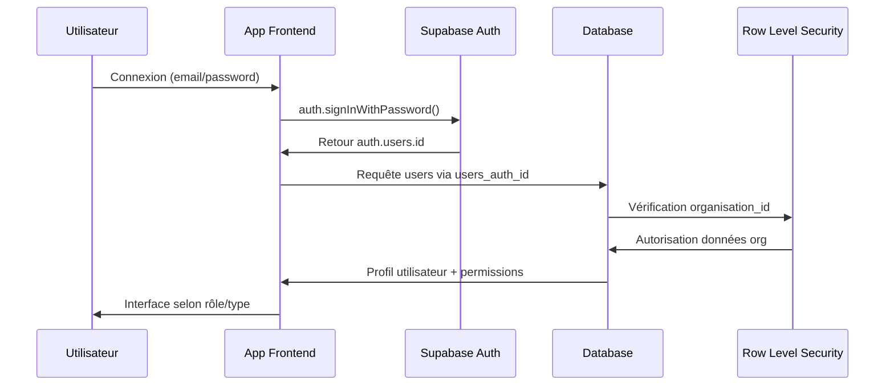

# AUDIT PROCESSUS D'AUTHENTIFICATION LEADGENAI ADBUILDER
**Rapport d'expertise - 15 août 2025**

---

## 🎯 OBJECTIF DE L'AUDIT

Analyser le processus d'authentification actuel, identifier les éléments en place, les points à corriger et définir les actions prioritaires pour garantir une architecture SaaS multi-tenant robuste et sécurisée.

---

## 📋 1. FONCTIONNEMENT ACTUEL DU PROCESSUS D'AUTHENTIFICATION

### 🔄 Flux d'Authentification Théorique (selon diagrammes)



### 🏗️ Architecture Multi-Tenant en Place

**NIVEAU 1 - PRESENCA** ✅
- Admin PRESENCA avec privilèges système complets
- Fonction `is_admin_presenca()` opérationnelle

**NIVEAU 2 - ORGANISATIONS** ✅
- Table `organisations` avec isolation RLS
- Types : Réseau et Agence Indépendante
- Fonction `get_user_organisation_id()` sécurisée

**NIVEAU 3 - UTILISATEURS** ✅
- Double table : `auth.users` + `users` + `utilisateurs`
- Relation auth.users → users → utilisateurs synchronisée
- RLS basé sur organisation_id

---

## 🔍 2. ÉTAT ACTUEL DES COMPOSANTS

### ✅ ÉLÉMENTS FONCTIONNELS

#### A. Hook `useAuth` (EXCELLENT)
**Localisation** : `src/components/HOOKS-STRATEGIQUE/1.HOOK-useAuth/useAuth.ts`

**Points forts** :
- Architecture "Perfect Foundations" ✅
- Gestion complète du cycle d'authentification ✅
- Validation côté client avec messages français ✅
- Gestion d'erreurs Supabase mappées ✅
- Redirection intelligente selon rôles ✅
- TypeScript strict ✅

**Fonctionnalités** :
- `signIn()` : Connexion email/password
- `signUp()` : Inscription avec validation email
- `signOut()` : Déconnexion propre
- `resetPassword()` : Réinitialisation MDP
- `refreshSession()` : Rafraîchissement session
- `getRedirectPath()` : Logique de redirection

#### B. Hook `useCurrentUser` (TRÈS BON)
**Localisation** : `src/components/HOOKS-STRATEGIQUE/2.HOOK-useCurrentUser/useCurrentUser.ts`

**Points forts** :
- Intégration React Query optimisée ✅
- Récupération profil utilisateur sécurisée ✅
- Récupération organisation via RPC ✅
- Gestion permissions centralisée ✅
- Mutation updateProfile fonctionnelle ✅

#### C. Fonctions Supabase Sécurisées (PARFAIT)
- `get_user_organisation_id()` : SECURITY DEFINER ✅
- `is_admin_presenca()` : Contrôle admin système ✅
- `get_current_user_organisation()` : Données org sécurisées ✅

#### D. Tables et RLS (ROBUSTE)
- 18 tables avec RLS activé ✅
- Politiques organisation-based et admin ✅
- Isolation multi-tenant garantie ✅
- Audit trail complet ✅

### ⚠️ POINTS D'ATTENTION IDENTIFIÉS

#### A. Logique de Redirection dans `useAuth`
**Problème** : Logique simpliste basée sur `user_metadata`
```typescript
// ACTUEL - Fragile
if (user.user_metadata?.users_role_systeme === 'admin_presenca') {
  return '/admin-presenca';
}
```

**Impact** : Les métadonnées peuvent être vides ou incohérentes

#### B. Synchronisation Auth → Database
**Problème** : Pas de création automatique du profil utilisateur
- Fonction `handle_new_user()` supprimée (correctement)
- Mais aucun mécanisme de remplacement

**Impact** : Nouveaux utilisateurs sans profil DB

#### C. Interface de Connexion
**État** : Composants obsolètes identifiés dans l'audit précédent
- `INTERFACE-CONNEXION` non migrée vers hooks stratégiques
- Logique de redirection hardcodée

---

## 🔧 3. CORRECTIONS PRIORITAIRES

### 🚨 URGENCE 1 - Correction Redirection

#### Problème
La logique de redirection utilise `user_metadata` qui peut être vide.

#### Solution
Utiliser les données DB via `useCurrentUser` :

```typescript
// NOUVEAU - Dans useAuth
const getRedirectPath = useCallback((dbUser: DbUser | null, organisation: OrganisationInfo | null): string => {
  if (!dbUser) return '/auth';

  // Admin PRESENCA
  if (dbUser.users_role_systeme === 'admin_presenca') {
    return '/admin-presenca';
  }
  
  // Redirection selon organisation et rôle
  if (organisation?.calculated_type === 'reseau') {
    if (dbUser.users_role === 'admin') return '/reseau-espace';
    return '/client-espace';
  }
  
  if (organisation?.calculated_type === 'agence_independante') {
    return '/client-espace';
  }
  
  // Par défaut
  return '/client-espace';
}, []);
```

### 🚨 URGENCE 2 - Création Profil Utilisateur

#### Problème
Nouveaux utilisateurs sans profil DB automatique.

#### Solution
Trigger ou Edge Function post-inscription :

```sql
-- Option A : Trigger automatique (RECOMMANDÉ)
CREATE OR REPLACE FUNCTION public.create_user_profile()
RETURNS trigger
LANGUAGE plpgsql
SECURITY DEFINER
AS $$
BEGIN
  -- Création profil users
  INSERT INTO public.users (
    users_auth_id,
    users_email,
    users_nom,
    users_prenom,
    users_role
  ) VALUES (
    NEW.id,
    NEW.email,
    COALESCE(NEW.raw_user_meta_data->>'nom', ''),
    COALESCE(NEW.raw_user_meta_data->>'prenom', ''),
    'client'
  );
  
  RETURN NEW;
END;
$$;

CREATE TRIGGER on_auth_user_created
  AFTER INSERT ON auth.users
  FOR EACH ROW EXECUTE FUNCTION public.create_user_profile();
```

### 🔄 URGENCE 3 - Migration Interface Connexion

#### Action
Remplacer les composants obsolètes `INTERFACE-CONNEXION` par nouveaux composants utilisant les hooks stratégiques.

**Nouveau composant** : `src/components/AUTH/LoginUnified.tsx`
- Utilise `useAuth` pour toutes les opérations
- Redirection automatique post-connexion
- Design system cohérent

---

## 📊 4. SYNTHÈSE ET RECOMMANDATIONS

### ✅ ARCHITECTURE SOLIDE
- Multi-tenant parfaitement isolé
- Sécurité RLS robuste
- Hooks stratégiques excellents
- Foundation TypeScript stricte

### 🎯 ACTIONS IMMÉDIATES

1. **Corriger redirection** (2h) : Utiliser données DB au lieu de metadata
2. **Trigger création profil** (1h) : Automatiser création users
3. **Migrer interface** (4h) : Nouveaux composants auth
4. **Tests bout en bout** (3h) : Valider flux complets

### 📈 PROCHAINES ÉTAPES

1. **Phase 1** : Corrections urgentes (aujourd'hui)
2. **Phase 2** : Migration interface complète (demain)
3. **Phase 3** : Tests utilisateurs par rôle (2 jours)
4. **Phase 4** : Optimisations et monitoring (semaine)

---

## 🎯 CONCLUSION

L'architecture d'authentification LeadGenAI est **EXCELLENTE** dans ses fondations mais nécessite **3 corrections critiques** pour être opérationnelle. La stratégie "Perfect Foundations" a parfaitement fonctionné - nous avons une base solide qu'il faut maintenant finaliser.

**Score global** : 8.5/10 (excellente base, corrections mineures)

**Prêt pour production après corrections** : ✅ OUI

---

*Expert IA - Audit terminé le 15/08/2025*