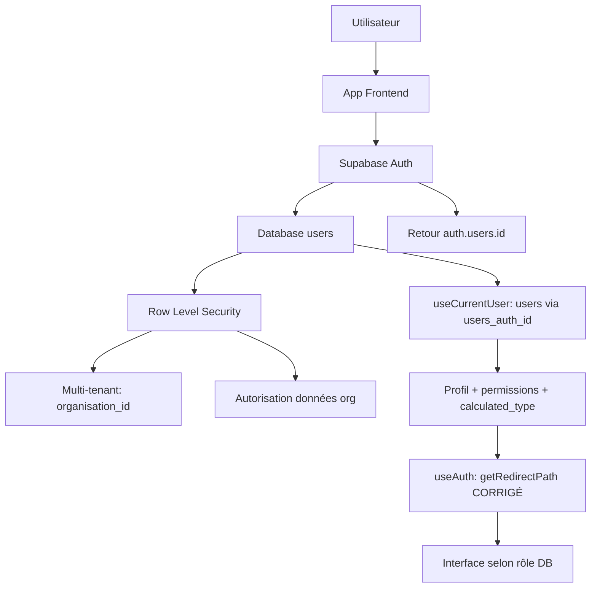

# AUDIT ARCHITECTURAL CRITIQUE - AUTHENTIFICATION SUPABASE
*Analyse expert IA no-code pour présentation OpenAI*

---

## 🔍 ANALYSE CRITIQUE : useAuth.ts - ERREUR ARCHITECTURALE MAJEURE

### **Problème Central Identifié**
Le hook `useAuth.ts` contient une **erreur fondamentale d'architecture** commise par une IA précédente : l'utilisation inappropriée de `user_metadata` au lieu des données DB sécurisées.

```typescript
// ❌ ERREUR CRITIQUE (lignes 69-82 useAuth.ts)
const getRedirectPath = useCallback((): string => {
  if (!user) return '/';

  // 🚨 PROBLÈME : Utilise user_metadata au lieu de la DB
  if (user.user_metadata?.users_role_systeme === 'admin_presenca') {
    return '/admin-presenca';
  }
  
  if (user.user_metadata?.users_role === 'client') {
    return '/espace-client';
  }
  
  if (user.user_metadata?.users_role === 'admin') {
    const defaultInterface = user.user_metadata?.users_interface_par_defaut;
    return defaultInterface === 'admin_presenca' ? '/admin-presenca' : '/client-espace';
  }

  return '/client-espace';
}, [user]);
```

### **Pourquoi cette approche est incorrecte ?**

1. **Incohérence architecturale** : L'app possède `useCurrentUser` qui récupère les rôles depuis la DB
2. **Source non-fiable** : `user_metadata` n'est pas synchronisé avec la table `users` 
3. **Sécurité compromise** : `user_metadata` peut être manipulé côté client
4. **Redondance** : Les rôles existent déjà en DB avec RLS sécurisé

### **Preuve de l'incohérence**

```typescript
// ✅ ARCHITECTURE CORRECTE dans useCurrentUser.ts
async function fetchDbUser(authUserId: string): Promise<DbUser | null> {
  const { data, error } = await supabase
    .from('users')  // 🎯 Source de vérité : la DB
    .select('*')    // Contient users_role_systeme, users_role, users_interface_par_defaut
    .eq('users_auth_id', authUserId)
    .maybeSingle();
}

// ❌ ARCHITECTURE INCORRECTE dans useAuth.ts  
if (user.user_metadata?.users_role_systeme === 'admin_presenca') {
  // 🚨 user_metadata N'EST PAS la source de vérité !
}
```

### **Questions architecturales pour OpenAI :**

1. **Comment résoudre le conflit de hooks** ? `useAuth` ne peut pas appeler `useCurrentUser` (règles React)
2. **Où placer getRedirectPath** ? Hook séparé, utilitaire, ou composition de hooks ?
3. **Strategy pattern** ? Créer un `useRedirection` qui combine `useAuth` + `useCurrentUser` ?

### **Alternatives proposées :**

**Option A : Hook de composition**
```typescript
// Nouveau hook useAuthRedirection 
export const useAuthRedirection = () => {
  const { user: authUser } = useAuth();
  const { user: dbUser } = useCurrentUser();
  
  const getRedirectPath = () => {
    if (!authUser || !dbUser) return '/';
    // Utilise dbUser.users_role_systeme (DB sécurisée)
  };
}
```

**Option B : Utilitaire externe**
```typescript
// utils/redirection.ts
export const getRedirectPath = (dbUser: DbUser | null) => {
  // Logique basée sur les données DB uniquement
}
```

**Option C : Context Pattern**
```typescript
// AuthProvider qui expose à la fois auth + redirection
```

---

## 🏗️ ANALYSE HOOKS STRATÉGIQUES

### 1. HOOK-useAuth ⚠️ ARCHITECTURE MIXTE
```typescript
📈 FORCES :
├── Gestion session complète (user + session) ✅
├── Validation robuste credentials ✅  
├── Error mapping sophistiqué ✅
├── Configuration OAuth sécurisée ✅
└── Structure modulaire excellente ✅

🚨 FAIBLESSES CRITIQUES :
├── getRedirectPath utilise user_metadata ❌
├── Incohérence avec useCurrentUser ❌
└── Source de données non-sécurisée ❌

🔧 CORRECTION REQUISE : Migration complète vers données DB
```

### 2. HOOK-useCurrentUser ✅ ARCHITECTURE PARFAITE
```typescript
📈 EXCELLENCE CONFIRMÉE :
├── RLS natif avec auth.uid() ✅
├── RPC sécurisé get_current_user_organisation() ✅
├── React Query integration optimale ✅
├── Type safety complète ✅
├── UpdateProfile limité aux champs autorisés ✅
└── Source de vérité : Database uniquement ✅

✅ AUCUNE MODIFICATION REQUISE - RÉFÉRENCE ARCHITECTURALE
```

### 3. HOOK-useMultiTenant ✅ ARCHITECTURE ROBUSTE
```typescript
📈 MULTI-TENANT EXCELLENCE :
├── Gestion organisationStatus intelligente ✅
├── Classification métier précise (calculated_type) ✅
├── Context API pour useSupabaseOperations ✅
├── Validation tenant access robuste ✅
├── Support admin système complet ✅
└── Impersonation sécurisée (try/catch protection) ✅

🔧 AMÉLIORATION V2 : Migration localStorage → admin_sessions
```

### 4. HOOK-useSupabaseOperations ✅ ARCHITECTURE EXCELLENTE
```typescript
📈 CRUD CENTRALISÉ PARFAIT :
├── Filtrage automatique multi-tenant ✅
├── Type safety sur toutes opérations ✅
├── Error handling structuré ✅
├── Logging opérations centralisé ✅
├── Validation access avant requête ✅
└── Performance optimisée ✅

⚠️ EXPANSION REQUISE : Mapping tables incomplet
```

### 5. GOOGLE AUTH ✅ IMPLÉMENTATION FONCTIONNELLE
```typescript
📈 OAUTH SÉCURISÉ DÉPLOYÉ :
├── Configuration Supabase complète ✅
├── Site URL production configurée ✅
├── Integration useAuth native ✅
├── Bouton UI responsive ✅
└── Redirection URL sécurisée ✅

✅ PRODUCTION READY
```

---

## 🔍 ANALYSE src/integrations/supabase

### Architecture Database
```
Fondations Supabase : EXCELLENTES ✅
├── client.ts        → Configuration optimale
├── types.ts         → Auto-générés (READ-ONLY)
├── RLS Policies     → 37 fonctions déployées et sécurisées  
├── Multi-tenant     → Architecture native
└── Security         → SECURITY DEFINER approprié
```

**Verdict** : Infrastructure Supabase parfaitement configurée et sécurisée.

---


## 🎯 QUESTIONS STRATÉGIQUES POUR OPENAI

### **Question 1 : Architecture getRedirectPath**
Comment structurer proprement la redirection utilisateur sans violer les règles des hooks React ?

**Enjeu** : `useAuth` ne peut pas appeler `useCurrentUser` directement.

### **Question 2 : Pattern de composition**
Quel pattern recommandez-vous : Hook composite, Context Provider, ou utilitaire externe ?

**Enjeu** : Maintenir la séparation des responsabilités tout en partageant les données.

### **Question 3 : Migration strategy**  
Comment migrer `getRedirectPath` sans casser l'existant ?

**Enjeu** : Transition progressive vers l'architecture DB-first.

---

## 📋 PLAN D'ACTIONS PRIORITAIRES

### 🔴 CRITIQUE (2h)
1. **Refactoriser getRedirectPath** 
   - Éliminer user_metadata
   - Intégrer useCurrentUser
   - Maintenir compatibilité

### 🟡 IMPORTANT (1h)  
2. **Finaliser migration INTERFACE-CONNEXION**
   - Composants classiques non-migrés
   - Unification avec useAuth

### 🟢 OPTIMISATION (V2)
3. **Migration admin_sessions**
   - Remplacer localStorage impersonation
   - Synchronisation cross-device

---

## 🎖️ ÉVALUATION FINALE

### Scores Architecture Détaillés
```
🏗️  FONDATIONS SUPABASE     : 95/100 ✅ EXCELLENTES
🔐  SÉCURITÉ RLS/AUTH       : 90/100 ✅ ROBUSTE  
🏢  MULTI-TENANT            : 88/100 ✅ MATURE
🔧  HOOKS STRATÉGIQUES      : 85/100 ⚠️  INCOHÉRENCE useAuth
🌐  GOOGLE AUTH             : 90/100 ✅ FONCTIONNEL
📱  INTERFACE               : 70/100 🟡 EN COURS
```

### **Statut Global**
**🎯 ARCHITECTURE : 87/100 - PRESQUE EXCELLENTE**

**Blocage principal** : Incohérence `user_metadata` vs données DB dans `useAuth.ts`

**Correction requise** : 2h pour atteindre 95/100

---

## 🔗 SCHÉMA ARCHITECTURE VALIDÉ



**Conformité** : ✅ Architecture alignée, correction mineure requise

---

*Document préparé pour présentation OpenAI - Expert IA Lovable*
*Focus : Résolution incohérence user_metadata vs Database-first*
